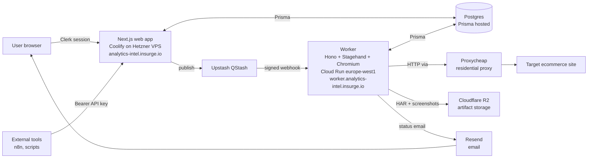

# Architecture

## What it does

Submit a URL → an autonomous browser walks the shopping funnel (home → category → product → add-to-cart → cart → checkout) → captures every GA4 event and ad-pixel request fired during the walk → analyzes coverage and quality with a deterministic rule engine + AI → produces a scored audit report. Used as a lead magnet for paid GA4 implementation services.

## Components



## Audit lifecycle

```
PENDING → RUNNING → ANALYZING → RENDERING → COMPLETE
                                          ↘
                                            FAILED (terminal, with failureReason)
```

| State | Set by | Meaning |
|---|---|---|
| PENDING | Web on submit | Audit row created, queued |
| RUNNING | Worker at `audit-runner` start | Browser launched, walking funnel |
| ANALYZING | Worker after walk | Parsing HAR for GA4 events, building AuditDocument |
| RENDERING | Worker before persist | Persisting findings + scorecard |
| COMPLETE | Worker on persist success | Results visible to user |
| FAILED | Worker `.catch()` | Browser crash, timeout, or worker panic |

## Data flow — single audit (numbered)

1. User (or external API caller) submits a URL via `POST /api/audits` (Clerk) or `POST /api/v1/audits` (API key).
2. Web app validates input with Zod, creates `Audit` row with `status=PENDING`.
3. Web publishes to QStash with body `{ auditId, notifyEmail }` and target URL `${WORKER_BASE_URL}/audit`. (Dev fallback: direct fetch to worker.)
4. QStash signs the request and POSTs to the worker.
5. Worker verifies signature (`@upstash/qstash` Receiver), updates audit `status=RUNNING`.
6. Worker launches Chromium via Stagehand with stealth init script + Proxycheap residential proxy + viewport 1440×900.
7. Context-level `request` listener writes every network request to an in-memory HAR.
8. Stagehand agent walks the funnel using custom tools (`logStep`, `getEvents`, `checkUrl`, `verifyCartChange`). Hybrid mode: DOM + vision-based fallback.
9. Walk ends. Worker parses GA4 events from the complete HAR (deterministic — no race conditions). Detects ad pixels and CDPs from network URLs.
10. Worker runs the rule engine (`packages/audit-core/src/rules/`) producing `Finding[]` and a scorecard.
11. AI analysis: two-call OpenAI pattern — call 1 with web search for ecosystem context, call 2 to structure as JSON.
12. Worker persists everything to Postgres (`status=COMPLETE`), uploads HAR to R2, sends Resend email.
13. Web's audit detail page polls `GET /api/audits/:id` and renders results.

## Locked tech stack

| Layer | Choice | Why |
|---|---|---|
| Frontend | Next.js 16 App Router | Server components, turbopack dev, mature App Router |
| Auth | Clerk | Multi-tenant, social login, organizations primitive |
| DB | Postgres + Prisma 7 | JSON columns for flexible event payloads, mature ORM |
| Queue | Upstash QStash | HTTP-native (works with Cloud Run), signed delivery, retries |
| Browser automation | Stagehand v3 (hybrid mode) | LLM agent + DOM tools + vision fallback |
| AI | OpenAI / Gemini / Anthropic via Stagehand | Configurable per-deploy via `STAGEHAND_MODEL` |
| Storage | Cloudflare R2 | S3-compatible, no egress fees |
| Email | Resend | Simple, reliable transactional |
| Worker host | Cloud Run | Scales 0→N, per-instance concurrency control, 60min timeouts |
| Web host | Coolify (Hetzner) | Self-hosted, fixed cost, predictable web traffic |

See `CLAUDE.md` at repo root for the full locked-decisions list.

## Critical safety boundaries

1. **Payment stop-list** — deterministic code in `apps/worker/src/stop-list.ts`. The agent must never click `Place Order`, `Pay Now`, etc.
2. **SSRF prevention** — URLs validated as HTTPS, not localhost / private IP, including post-DNS check.
3. **Incognito only** — no persisted cookies between audits, no login.
4. **HAR sanitization** — `Cookie` and `Authorization` headers stripped before storage in R2.
